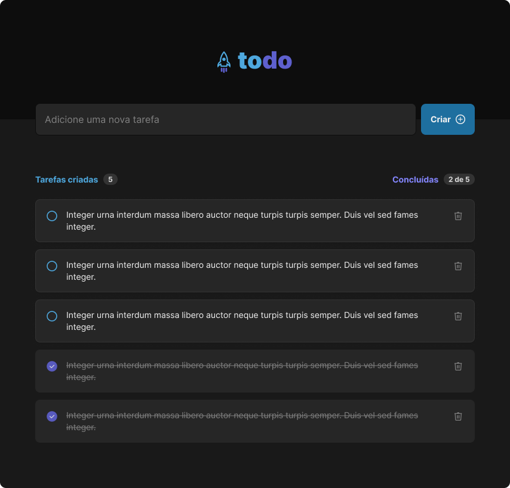

  

# Todo List em HTML/CSS

Este repositório contém o código-fonte de um projeto de Todo List (Lista de Tarefas) desenvolvido com HTML e CSS. O objetivo deste projeto é demonstrar as habilidades básicas de desenvolvimento web, incluindo estruturação de conteúdo com HTML e estilização com CSS. É um excelente recurso para iniciantes que desejam aprender mais sobre desenvolvimento frontend.

## Visão Geral

O projeto consiste em uma aplicação web simples que permite aos usuários adicionar, visualizar e remover tarefas de uma lista. Foi projetado para ser intuitivo e fácil de usar, com foco na usabilidade e no design responsivo.

## Tecnologias Utilizadas

- HTML5: Para a estruturação do conteúdo da página.
- CSS3: Para estilizar e layout da página, incluindo responsividade.

## Funcionalidades

- Adicionar novas tarefas à lista.
- Visualizar tarefas adicionadas.
- Remover tarefas da lista.

## Como Usar

Para usar este projeto, siga estas etapas:

1. Clone o repositório para sua máquina local usando `git clone https://github.com/jaimeneeves/todo-list-html-css.git`
2. Abra o arquivo `index.html` em seu navegador para visualizar o projeto.

Confira o design do projeto Todo List no Figma [aqui](https://www.figma.com/community/file/1175262836322989600/todo-list).

## Contribuindo

Contribuições são sempre bem-vindas! Se você tem alguma sugestão para melhorar este projeto, sinta-se à vontade para fazer um fork do repositório, fazer suas alterações e enviar um pull request. Você também pode abrir uma issue para discutir as alterações propostas ou outros feedbacks.

